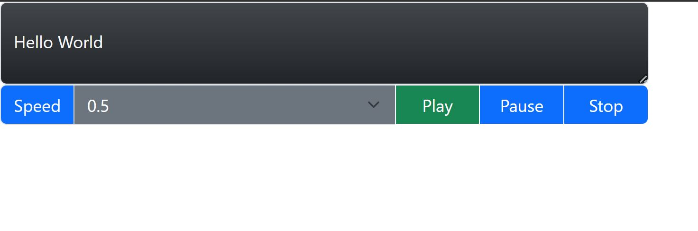

# Text to Speech

## Description

I wanted to create an app that allowed you to type in text and turn it into audio. 

This has been achieved by:
* Using the Web Speech API 
   

Type in what you'd like to change to audio:

 

Then hit play to hear what you have typed. You can adjust the speed, pause and stop the audio.
 

## Installation

Please use the following link to access the application: https://e-davies.github.io/text-to-speech/

## Technical skills used in this project

